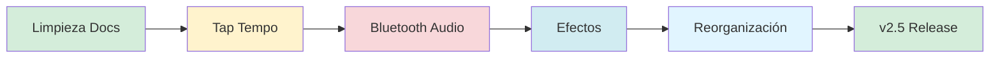

# 🎯 PLAN DE REORGANIZACIÓN - DRUM MACHINE v2.5

## Objetivos

1. ✅ **Funcionamiento profesional** - Encender y usar, sin configuración
2. ✅ **Audio Bluetooth** - Salida inalámbrica
3. ✅ **Vista de Efectos** - Control de efectos globales
4. ✅ **Tap Tempo** - Establecer BPM naturalmente
5. ✅ **Código limpio** - Eliminar redundancias
6. ✅ **Documentación unificada** - Solo INFORME_TECNICO_PRODUCTO.md

---

## 📁 FASE 1: Limpieza de Archivos

### Archivos a ELIMINAR (redundantes):

```bash
# Documentación redundante
- AUDIO_SYSTEM.md              # Info ya en informe técnico
- CHANGELOG_v2.md              # Historial ya en informe
- COMANDOS_RAPIDOS.md          # Irá a README simplificado
- GUIA_IMPLEMENTACION_MEJORAS.md # Ya no necesario
- GUIA_VISTAS.md               # Info ya en informe
- INSTALACION_RPI.md           # Irá a README simplificado
- INSTRUCCIONES_COMMIT.md      # Ya no necesario
- INSTRUCCIONES_GITHUB.md      # Ya no necesario
- RESUMEN_SESION.md            # Temporal, ya cumplió su función
- ROADMAP_MEJORAS.md           # Reemplazado por este plan
- VISTAS_FINALES.md            # Info ya en informe
```

### Archivos a MANTENER y actualizar:

```bash
✅ INFORME_TECNICO_PRODUCTO.md  # DOCUMENTO PRINCIPAL - Todo aquí
✅ README.md                     # Breve, para GitHub
✅ PINOUT.txt                    # Referencia rápida de hardware
```

### Archivos core del proyecto (mantener):

```bash
✅ main.py
✅ audio_engine.py
✅ audio_processor.py
✅ sequencer.py
✅ view_manager.py
✅ button_handler.py
✅ config.py
✅ hardware/
✅ samples/
✅ patterns/
```

### Nuevos archivos a crear:

```bash
🆕 effects_manager.py           # Gestor de efectos de audio
🆕 bluetooth_audio.py           # Salida Bluetooth
🆕 tap_tempo.py                 # Detector de tap tempo
```

### Scripts de utilidad (mantener):

```bash
✅ drummachine.service
✅ install_service.sh
✅ optimize_boot.sh
✅ splash_screen.py
✅ midi_handler.py              # Útil, mantener
```

---

## 💻 FASE 2: Implementaciones Prioritarias

### A. Audio Bluetooth (Alta prioridad)

**Objetivo:** Salida de audio inalámbrica a parlantes/auriculares Bluetooth

**Tecnología:**
- PulseAudio (ya incluido en Raspbian)
- Bluetoothctl para pairing
- pygame compatible con PulseAudio

**Implementación:**

```python
# bluetooth_audio.py
class BluetoothAudio:
    def __init__(self):
        self.connected_device = None
        
    def scan_devices(self):
        """Escanear dispositivos Bluetooth disponibles"""
        
    def connect(self, device_mac):
        """Conectar a dispositivo Bluetooth"""
        
    def set_as_audio_sink(self):
        """Configurar como salida de audio"""
        
    def disconnect(self):
        """Desconectar dispositivo"""
```

**Configuración automática:**
```bash
# En optimize_boot.sh agregar:
sudo systemctl enable bluetooth
```

**Control desde drum machine:**
- Hold BTN 15 (Mute) + BTN 9 (Mode) = Menú Bluetooth
- Display muestra dispositivos disponibles
- Seleccionar con Pot 0, confirmar con BTN 13

---

### B. Vista de Efectos (Alta prioridad)

**Objetivo:** Aplicar efectos a la salida general (master)

**Efectos a implementar:**

1. **Reverb** (sala, plate, hall)
2. **Delay** (tiempo variable)
3. **Compressor** (dynamic range)
4. **Filter** (low-pass, high-pass)
5. **Distortion/Saturation**

**Interfaz:**

```
Vista EFFECTS (nueva):
┌────────────────────────────────────────────────┐
│ REV    DLY    CMP    FLT    SAT                │
│ ███    ██     ████   ██     █                  │  Barras de nivel
│  42%   25%    65%   30%    12%                 │  Valores
└────────────────────────────────────────────────┘

Control:
- BTN 12 (Clear) largo = Activar vista EFFECTS
- Pot 1-5 = Ajustar cada efecto
- BTN 13 = Guardar preset
```

**Arquitectura:**

```python
# effects_manager.py
class EffectsManager:
    def __init__(self):
        self.reverb_level = 0.0
        self.delay_time = 0.0
        self.compressor_ratio = 1.0
        self.filter_cutoff = 1.0
        self.saturation = 0.0
        
    def process(self, audio_data):
        """Aplicar efectos en cadena"""
        processed = audio_data
        
        if self.compressor_ratio > 1.0:
            processed = self.apply_compressor(processed)
            
        if self.filter_cutoff < 1.0:
            processed = self.apply_filter(processed)
            
        if self.saturation > 0:
            processed = self.apply_saturation(processed)
            
        if self.delay_time > 0:
            processed = self.apply_delay(processed)
            
        if self.reverb_level > 0:
            processed = self.apply_reverb(processed)
            
        return processed
```

**Integración en audio_processor.py:**
```python
# Después del soft limiter, antes de retornar:
if effects_manager.has_active_effects():
    processed = effects_manager.process(processed)
```

---

### C. Tap Tempo (Media prioridad)

**Objetivo:** Establecer BPM golpeando un botón

**Implementación:**

```python
# tap_tempo.py
import time

class TapTempo:
    def __init__(self, min_taps=2, max_taps=8, timeout=3.0):
        self.tap_times = []
        self.min_taps = min_taps
        self.max_taps = max_taps
        self.timeout = timeout
        
    def tap(self):
        """Registrar un tap y calcular BPM si es posible"""
        current_time = time.time()
        
        # Limpiar taps antiguos
        self.tap_times = [t for t in self.tap_times 
                          if current_time - t < self.timeout]
        
        # Agregar nuevo tap
        self.tap_times.append(current_time)
        
        # Limitar cantidad
        if len(self.tap_times) > self.max_taps:
            self.tap_times.pop(0)
        
        # Calcular BPM si hay suficientes taps
        if len(self.tap_times) >= self.min_taps:
            intervals = []
            for i in range(len(self.tap_times) - 1):
                intervals.append(self.tap_times[i+1] - self.tap_times[i])
            
            avg_interval = sum(intervals) / len(intervals)
            bpm = 60.0 / avg_interval
            
            # Validar rango
            if 60 <= bpm <= 200:
                return int(bpm)
        
        return None
    
    def reset(self):
        """Limpiar taps"""
        self.tap_times = []
```

**Control:**
- Doble-click BTN 11 (Tempo +) = Activar modo Tap
- LED Amarillo parpadea al tempo
- Golpear BTN 11 al ritmo deseado
- Display muestra BPM en tiempo real
- Después de 3s sin tap, se fija el BPM

---

### D. Reorganización del Código

**Estructura optimizada:**

```
DRUMMACHINE/
├── core/                      # Módulos principales
│   ├── __init__.py
│   ├── drum_machine.py       # main.py renombrado
│   ├── audio_engine.py
│   ├── audio_processor.py
│   ├── sequencer.py
│   └── config.py
│
├── ui/                        # Interfaz de usuario
│   ├── __init__.py
│   ├── view_manager.py
│   ├── button_handler.py
│   └── splash_screen.py
│
├── features/                  # Características opcionales
│   ├── __init__.py
│   ├── midi_handler.py
│   ├── bluetooth_audio.py
│   ├── effects_manager.py
│   └── tap_tempo.py
│
├── hardware/                  # Drivers de hardware
│   ├── __init__.py
│   ├── button_matrix.py
│   ├── led_matrix.py
│   ├── adc_reader.py
│   └── led_controller.py
│
├── data/                      # Datos del proyecto
│   ├── samples/
│   └── patterns/
│
├── scripts/                   # Scripts de instalación
│   ├── install_service.sh
│   └── optimize_boot.sh
│
├── main.py                    # Punto de entrada simple
├── drummachine.service
├── requirements.txt
├── INFORME_TECNICO_PRODUCTO.md  # DOCUMENTACIÓN PRINCIPAL
├── README.md                    # Breve
└── PINOUT.txt
```

**main.py simplificado:**
```python
#!/usr/bin/env python3
"""
Drum Machine - Punto de entrada
"""
from core.drum_machine import DrumMachine

if __name__ == "__main__":
    drum = DrumMachine()
    drum.run()
```

---

## 📝 FASE 3: Documentación Unificada

**INFORME_TECNICO_PRODUCTO.md será el ÚNICO documento técnico.**

**Estructura actualizada:**

```markdown
# INFORME TÉCNICO DE PRODUCTO

## 1. INTRODUCCIÓN Y EVOLUCIÓN

## 2. ESPECIFICACIONES TÉCNICAS
   - Hardware
   - Software
   - Rendimiento

## 3. ARQUITECTURA DEL SISTEMA
   - Diagramas Mermaid
   - Módulos principales
   - Flujo de datos

## 4. CARACTERÍSTICAS IMPLEMENTADAS
   - Secuenciador 32 pasos
   - Sistema de vistas
   - Audio profesional con efectos
   - Bluetooth output
   - Tap tempo
   - MIDI output
   - Autoarranque

## 5. GUÍA DE USO RÁPIDO
   - Controles
   - Modos de operación
   - Funciones avanzadas

## 6. INSTALACIÓN Y CONFIGURACIÓN
   - Preparación de RPi
   - Instalación del software
   - Configuración de hardware

## 7. DESARROLLO Y EVOLUCIÓN
   - Historial de commits (actualizado continuamente)
   - Decisiones técnicas
   - Mejoras futuras

## 8. BOM Y COSTOS

## 9. TROUBLESHOOTING

## 10. REFERENCIAS Y ANEXOS
```

**README.md simplificado:**

```markdown
# Raspberry Pi Drum Machine v2.5

Drum machine profesional con RPi 3 B+

## Quick Start

```bash
sudo ./install_service.sh  # Instalar
sudo reboot                # Listo!
```

## Características

- 32 pasos × 8 instrumentos
- Display LED 8×32
- Efectos master (Reverb, Delay, Compressor, etc.)
- Bluetooth audio output
- Tap tempo
- MIDI output
- Autoarranque

## Documentación

Ver `INFORME_TECNICO_PRODUCTO.md` para documentación completa.

## Hardware

Ver `PINOUT.txt` para conexiones.
```

---

## 🔄 ORDEN DE EJECUCIÓN

### Semana 1: Limpieza y Tap Tempo

**Día 1-2:**
- [ ] Eliminar archivos de documentación redundantes
- [ ] Consolidar info en INFORME_TECNICO_PRODUCTO.md
- [ ] Actualizar README.md (simplificado)
- [ ] Commit: "docs: Consolidate documentation into single technical report"

**Día 3-4:**
- [ ] Implementar tap_tempo.py
- [ ] Integrar en main.py
- [ ] Probar en RPi
- [ ] Commit: "feat: Add tap tempo to set BPM naturally"

### Semana 2: Bluetooth Audio

**Día 1-3:**
- [ ] Investigar PulseAudio + pygame
- [ ] Implementar bluetooth_audio.py
- [ ] Script de configuración automática
- [ ] Probar con parlantes Bluetooth
- [ ] Commit: "feat: Add Bluetooth audio output support"

### Semana 3: Sistema de Efectos

**Día 1-2:**
- [ ] Implementar effects_manager.py básico
  - Reverb simple
  - Delay
  - Compressor

**Día 3:**
- [ ] Agregar vista EFFECTS al view_manager
- [ ] Integrar en audio_processor

**Día 4:**
- [ ] Agregar filtros y distorsión
- [ ] Probar rendimiento
- [ ] Commit: "feat: Add master effects (reverb, delay, compressor, filter, saturation)"

### Semana 4: Reorganización de Código

**Día 1-2:**
- [ ] Crear estructura core/, ui/, features/, hardware/
- [ ] Mover archivos a nuevas carpetas
- [ ] Actualizar imports
- [ ] Commit: "refactor: Reorganize codebase into modular structure"

**Día 3:**
- [ ] Testing completo
- [ ] Documentar en informe técnico
- [ ] Commit: "docs: Update technical report with v2.5 features"

**Día 4:**
- [ ] Release v2.5
- [ ] Tag en Git
- [ ] Backup completo

---

## 📊 Prioridades Finales



---

## ✅ Checklist de Completitud

Drum Machine v2.5 estará completa cuando:

- [ ] Arranca automáticamente al encender RPi
- [ ] Audio sale por Bluetooth sin configuración manual
- [ ] Tiene efectos master controlables desde display
- [ ] Tap tempo funciona perfectamente
- [ ] Código está organizado y limpio
- [ ] Un solo documento técnico contiene toda la info
- [ ] README es simple y directo

---

**Siguiente acción:** Eliminar archivos redundantes y consolidar documentación.

