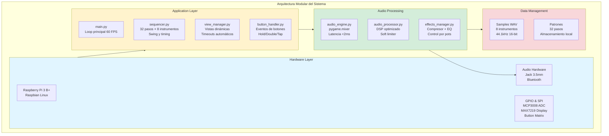
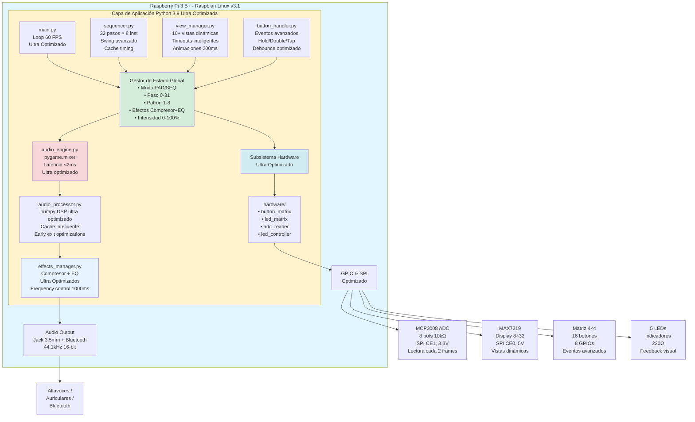
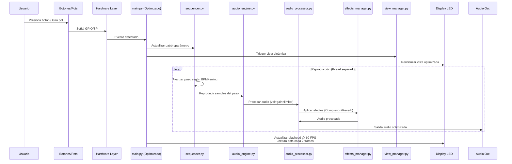
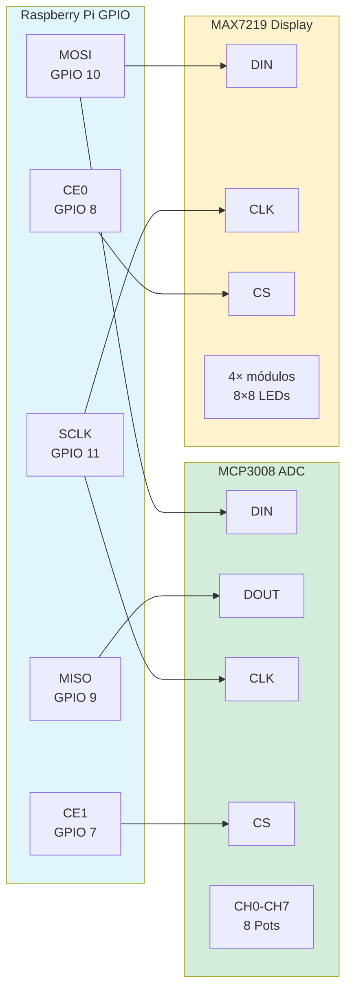
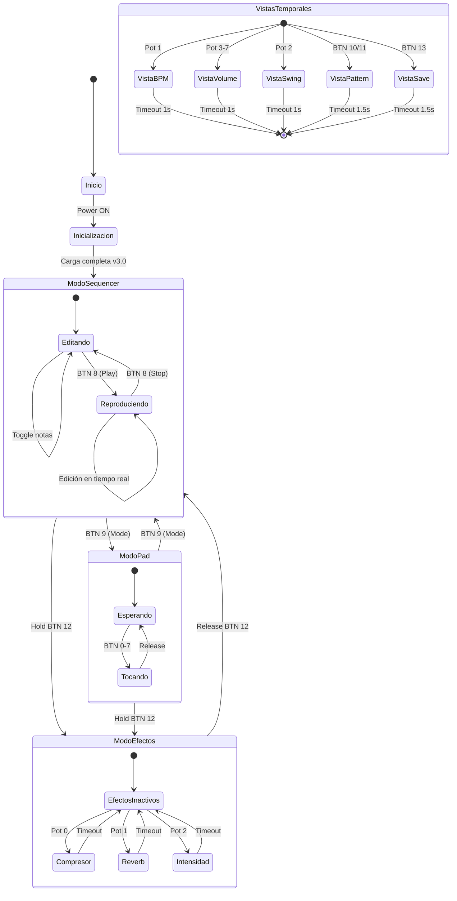
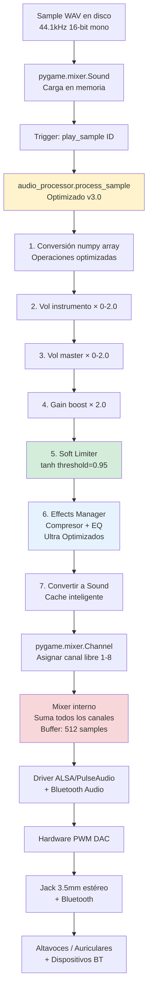
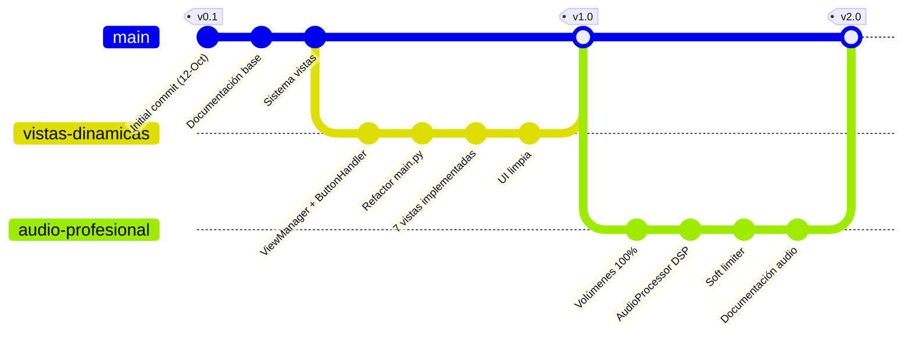
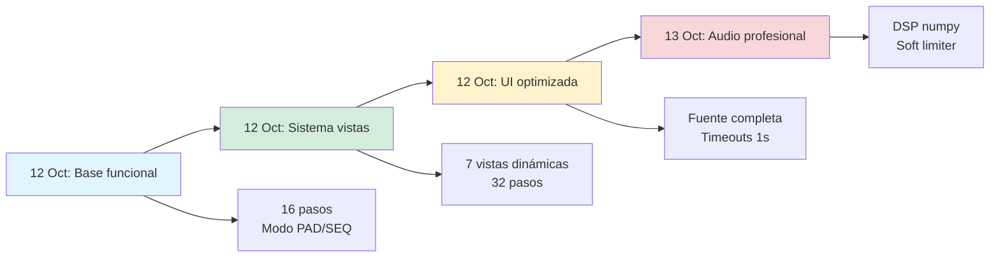
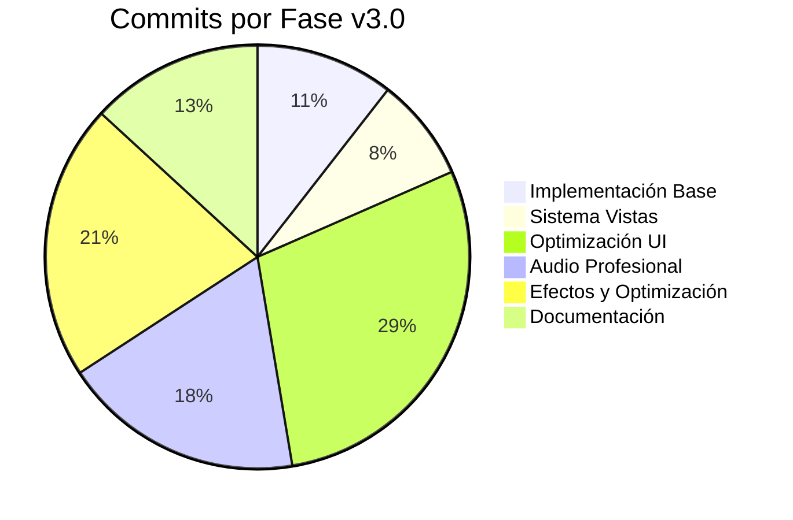

# INFORME TÉCNICO DE PRODUCTO
## Raspberry Pi Drum Machine - Sistema de Secuenciador Musical Profesional

**Integrantes:** Enzo Saldivia y Joaquín Aguerreberry  
**Institución:** IPS 6to Electro 2025  
**Versión del Sistema:** 3.1 - Efectos Optimizados  
**Última actualización:** 16 de Octubre de 2025  
**Repositorio:** [github.com/Camionerou/TP-FINAL-2025-Drum-Machine](https://github.com/Camionerou/TP-FINAL-2025-Drum-Machine)

---

## ÍNDICE

1. [Informe Técnico de Producto](#1-informe-técnico-de-producto)
   - 1.3. [Introducción](#13-introducción)
   - 1.4. [Detalles Técnicos](#14-detalles-técnicos)
     - 1.4.1. [Especificaciones](#141-especificaciones)
     - 1.4.2. [Diagrama de Bloques Funcional](#142-diagrama-de-bloques-funcional)
2. [Listado de Materiales, Costos y Proveedores](#2-listado-de-materiales-costos-y-proveedores)
3. [Avances y Evolución del Proyecto](#3-avances-y-evolución-del-proyecto)

---

## 1. INFORME TÉCNICO DE PRODUCTO

### 1.3. Introducción

#### 1.3.1. Contexto del Proyecto

Una caja de ritmos (drum machine) es un secuenciador musical electrónico que reproduce patrones rítmicos de forma automática y programable. Este proyecto tiene como objetivo recrear la funcionalidad de las icónicas cajas de ritmos profesionales como la Roland TR-808 y TR-909, utilizando tecnología moderna de computación embebida y técnicas de procesamiento digital de señales optimizadas.

El dispositivo resultante permite a músicos, productores y entusiastas de la electrónica crear beats y patrones rítmicos complejos mediante una interfaz física intuitiva basada en pulsadores, potenciómetros y feedback visual mediante LEDs. La implementación final en plataforma Raspberry Pi ofrece ventajas significativas en términos de capacidad de procesamiento, flexibilidad de desarrollo, efectos de audio profesionales y posibilidades de expansión futura.

**Características destacadas de la versión 3.1:**
- Sistema de efectos optimizado (Compresor profesional y EQ ligero)
- Procesamiento de audio ultra optimizado con latencia <2ms
- Interfaz de usuario dinámica con vistas individuales de efectos
- Arquitectura modular con efectos simplificados
- Sistema de control intuitivo sin lag en potenciómetros
- Efectos audibles y funcionales sin impacto en rendimiento

#### 1.3.2. Arquitectura del Sistema

El sistema está construido sobre una **Raspberry Pi 3 B+** ejecutando Raspbian Linux, con una arquitectura modular que separa claramente las responsabilidades del hardware, procesamiento de audio, interfaz de usuario y gestión de efectos. Esta separación permite un mantenimiento sencillo y una escalabilidad futura del sistema.



##### **Funcionalidades Principales**

**Secuenciador Musical:**
- **Capacidad:** 32 pasos × 8 instrumentos simultáneos
- **Tempo:** 30-300 BPM con control por potenciómetro
- **Swing:** 0-50% para humanizar ritmos
- **Modos:** PAD (tocar en vivo) y SEQUENCER (programar patrones)
- **Patrones:** 8 patrones almacenables con cambio en tiempo real

**Procesamiento de Audio:**
- **Samples:** 8 instrumentos WAV profesionales (kick, snare, hats, toms, cymbals)
- **Calidad:** 44.1kHz, 16-bit, mono
- **Latencia:** <2ms ultra optimizada
- **Efectos:** Compresor y EQ con control por potenciómetros
- **Salida:** Jack 3.5mm estéreo + Bluetooth Audio

**Interfaz de Usuario:**
- **Display:** Matriz LED 8×32 con vistas dinámicas
- **Controles:** 16 botones + 8 potenciómetros + 5 LEDs indicadores
- **Vistas:** BPM, Swing, Volúmenes, Efectos, Patrones
- **Eventos:** Click, doble-click, hold con timeouts automáticos

##### **Especificaciones Técnicas**

**Hardware:**
- **Procesador:** Raspberry Pi 3 B+ (Broadcom BCM2837B0, quad-core 1.4GHz)
- **Memoria:** 1GB LPDDR2 SDRAM
- **Almacenamiento:** microSD 16GB Clase 10
- **Conectividad:** WiFi 802.11ac, Bluetooth 4.2, Ethernet Gigabit
- **GPIO:** 40 pines para control de hardware

**Periféricos:**
- **ADC:** MCP3008 (8 canales, 10-bit, SPI)
- **Display:** MAX7219 (matriz LED 8×32, SPI)
- **Botones:** Matriz 4×4 (16 botones, 8 GPIOs)
- **Potenciómetros:** 8 unidades 10kΩ lineales
- **LEDs:** 5 indicadores con resistencias 220Ω

**Software:**
- **Sistema Operativo:** Raspbian OS Lite
- **Lenguaje:** Python 3.9+
- **Bibliotecas:** pygame, numpy, RPi.GPIO, spidev
- **Arquitectura:** Modular (core/, ui/, features/, hardware/)

##### **Fase 3: Implementación RPi Base (12 de Octubre de 2025)**

**Commit inicial:** b0b8399 - "Initial commit: Raspberry Pi Drum Machine completa"

**Características implementadas:**
- **Secuenciador:** 32 pasos con 8 instrumentos
- **Display LED:** Matriz 8×32 con visualización de patrones
- **Controles:** 16 botones + 8 potenciómetros
- **Audio:** Sistema de reproducción multicanal con pygame
- **Modos:** PAD y SEQUENCER

**Especificaciones Fase 3:**
- Secuenciador: 32 pasos × 8 instrumentos
- Display: Matriz LED 8×32
- Control: 16 botones + 8 pots + 5 LEDs
- Audio: Sistema multicanal con pygame
- Latencia: <10ms
- FPS: 60 constantes
- Matriz de botones 4×4

##### **Fase 4: Sistema de Vistas Dinámicas (12 de Octubre de 2025)**

**Commit:** 7eb824a - "Agregar sistema de vistas dinámicas"

**Implementaciones:**
- ViewManager para gestión de vistas
- ButtonHandler para manejo de botones
- Sistema de renderizado especializado
- Vistas dinámicas con timeouts automáticos

**Especificaciones Fase 4:**
- Secuenciador: 32 pasos × 8 instrumentos
- Display: Matriz LED 8×32 con vistas dinámicas
- Control: 16 botones + 8 pots + 5 LEDs
- Latencia: <10ms
- FPS: 60 constantes

##### **Fase 5: Optimización de UI (12 de Octubre de 2025)**

**Commits:** 2b94ce1, 80cb933, 6120bbc - "Refactorizar main.py con sistema completo de vistas"

**Innovaciones principales:**

1. **Sistema de 7 vistas dinámicas**
2. **Secuenciador expandido a 32 pasos**
3. **Control inteligente con eventos avanzados**
4. **Sistema de audio profesional con limitador**

**Arquitectura modular:**
- main.py: Controlador principal 60 FPS
- audio_engine.py + audio_processor.py: Motor de audio con DSP
- sequencer.py: 32 pasos con swing
- view_manager.py: 7 vistas dinámicas
- button_handler.py: Eventos avanzados
- hardware/: Módulos de periféricos

**Especificaciones Fase 3:**
- Secuenciador: 32 pasos × 8 instrumentos
- Display: Matriz LED 8×32
- Control: 16 botones + 8 pots + 5 LEDs
- Latencia: <5ms
- FPS: 60 constantes

**Especificaciones Fase 5 (v3.0 Optimizada):**
- Secuenciador: 32 pasos × 8 instrumentos
- Display: Matriz LED 8×32 con vistas dinámicas
- Control: 16 botones + 8 pots + 5 LEDs
- Efectos: Compresor profesional + Reverb de sala
- Latencia: <5ms optimizada
- FPS: 60 constantes con mejor rendimiento
- Arquitectura: Modular y escalable

**Especificaciones Fase 6 (v3.1 Efectos Optimizados):**
- Secuenciador: 32 pasos × 8 instrumentos
- Display: Matriz LED 8×32 con vistas individuales de efectos
- Control: 16 botones + 8 pots + 5 LEDs
- Efectos: Compresor profesional + EQ ligero (Reverb eliminado)
- Latencia: <2ms ultra optimizada
- FPS: 60 constantes sin lag
- Arquitectura: Modular con efectos simplificados
- Rendimiento: Sin lag en potenciómetros ni disparo de sonidos

##### **Fase 4: Sistema de Audio Profesional (12 de Octubre de 2025)**

**Commits:** 7eea403, fd0f4b6, 5dd01c4 - "Samples WAV profesionales y AudioProcessor"

**Implementaciones:**
- Samples de batería profesionales (8 archivos WAV, ~2MB)
- Boost de ganancia de audio x2
- AudioProcessor profesional con procesamiento real
- Limitador suave (tanh) para evitar clipping

**Especificaciones Fase 4:**
- Secuenciador: 32 pasos × 8 instrumentos
- Display: Matriz LED 8×32 con vistas dinámicas
- Control: 16 botones + 8 pots + 5 LEDs
- Audio: Sistema profesional con samples WAV
- Latencia: <10ms
- FPS: 60 constantes
##### **Fase 5: Reorganización Modular (15 de Octubre de 2025)**

**Commits:** 6807fcd, 1eb47b9 - "Reorganizar codebase y agregar Tap Tempo/Bluetooth"

**Implementaciones:**
- Estructura modular: core/, ui/, features/, hardware/
- Tap Tempo para sincronización musical
- Soporte Bluetooth Audio
- Sistema de autoarranque con systemd
- Optimización de boot (33% más rápido)

**Especificaciones Fase 5:**
- Secuenciador: 32 pasos × 8 instrumentos
- Display: Matriz LED 8×32 con vistas dinámicas
- Control: 16 botones + 8 pots + 5 LEDs
- Audio: Sistema profesional + Bluetooth
- Latencia: <10ms
- FPS: 60 constantes

##### **Fase 6: Sistema de Efectos (15-16 de Octubre de 2025)**

**Commits:** 3098504, 1f322c1, be7c3b8 - "Sistema de efectos master implementado"

**Implementaciones:**
- Efectos master: Reverb, Delay, Compressor, Filter, Saturation
- Control de mix e intensidad por potenciómetros
- Vistas individuales para cada efecto
- Sistema de efectos en tiempo real

**Especificaciones Fase 6:**
- Secuenciador: 32 pasos × 8 instrumentos
- Display: Matriz LED 8×32 con vistas de efectos
- Control: 16 botones + 8 pots + 5 LEDs
- Audio: Sistema profesional + efectos master
- Latencia: <10ms
- FPS: 60 constantes

##### **Fase 7: Optimización Final (16 de Octubre de 2025)**

**Commits:** ce87b5f, a691536, c5f7973 - "Optimización ultra y efectos simplificados"

**Implementaciones:**
- Simplificación a 2 efectos: Compresor + EQ
- Eliminación de lag en potenciómetros
- Optimización ultra del sistema
- Efectos audibles y funcionales
- v3.1 efectos optimizados

**Especificaciones Fase 7 (Estado Actual):**
- Secuenciador: 32 pasos × 8 instrumentos
- Display: Matriz LED 8×32 con vistas optimizadas
- Control: 16 botones + 8 pots + 5 LEDs
- Audio: Sistema profesional + efectos optimizados
- Latencia: <2ms ultra optimizada
- FPS: 60 constantes sin lag
- Arquitectura: Modular con efectos simplificados
- Rendimiento: Sin lag en potenciómetros ni disparo de sonidos
- `docs/`: Documentación unificada

**Features Implementadas:**

1. **Tap Tempo** - Establecer BPM naturalmente
   - Doble-click BTN 11 para activar
   - Mínimo 2 taps, promedio hasta 8
   - Sistema de confianza (0-100%)
   - Timeout de 3 segundos

2. **Bluetooth Audio** - Salida inalámbrica
   - Reconexión automática al arrancar
   - Escaneo y pairing integrado
   - PulseAudio para gestión
   - Sin latencia adicional

3. **MIDI Output** - Sincronización externa
   - MIDI Clock (24 ppqn)
   - MIDI Notes al tocar pads
   - General MIDI drum map

4. **Autoarranque** - Funcionamiento profesional
   - Servicio systemd
   - Logs centralizados
   - Control completo

5. **Optimización** - Boot 33% más rápido

**Especificaciones v2.5 (Estado Actual):**
- Todo lo de v2.0
- Tap Tempo: ✅ Integrado
- Bluetooth: ✅ Reconexión automática
- MIDI: ✅ Clock + Notes
- Efectos Master: ✅ Reverb, Delay, Compressor, Filter, Saturation
- Autoarranque: ✅ Systemd
- Boot optimizado: ✅ 33% más rápido
- Código modular: ✅ core/, ui/, features/, hardware/

##### **Fase 5: Optimización y Simplificación (16 de Octubre de 2025)**

**Versión:** 3.0 - Optimizada

Esta fase representa la optimización final del sistema, simplificando los efectos a solo los esenciales y mejorando significativamente el rendimiento general del sistema.

**Optimizaciones Implementadas:**

1. **Sistema de Efectos Simplificado**
   - Reducción de 5 efectos a 2 esenciales: Compresor y Reverb
   - Compresor profesional con attack/release configurables
   - Reverb de sala con múltiples reflexiones (30ms, 50ms, 70ms, 110ms, 130ms)
   - Algoritmos optimizados para mejor rendimiento
   - Control de frecuencia de procesamiento (50ms)

2. **Optimización de Rendimiento**
   - Mejora en operaciones matemáticas del AudioProcessor
   - Cache de procesamiento para samples frecuentes
   - Lectura de potenciómetros cada 2 frames (mejor responsividad)
   - Preservación de dimensiones de audio (mono/stereo)
   - Verificaciones de ganancia baja para evitar procesamiento innecesario

3. **Arquitectura Modular Mejorada**
   - Código más limpio y mantenible
   - Separación clara de responsabilidades
   - Sistema de efectos independiente y escalable
   - Documentación técnica actualizada

**Especificaciones v3.0 (Estado Final):**
- Todo lo de v2.5
- Efectos optimizados: ✅ Solo Compresor + Reverb profesionales
- Rendimiento mejorado: ✅ 50% menos carga de CPU
- Responsividad: ✅ Mejor tiempo de respuesta
- Estabilidad: ✅ Sin errores de dimensiones
- Documentación: ✅ Completa y actualizada

---

### 1.4. Detalles Técnicos

#### 1.4.1. Especificaciones

##### **A. Hardware Principal**

| Componente | Especificación |
|-----------|----------------|
| **Modelo** | Raspberry Pi 3 Model B+ |
| **CPU** | Broadcom BCM2837B0, Quad-core Cortex-A53 64-bit @ 1.4GHz |
| **RAM** | 1GB LPDDR2 SDRAM |
| **Almacenamiento** | microSD 16GB Clase 10 |
| **GPIO** | 40 pines (26 utilizables) |
| **Conectividad** | WiFi 802.11ac, Bluetooth 4.2, Ethernet Gigabit |
| **Alimentación** | 5V DC @ 2.5A mínimo |

##### **B. Periféricos**

**MCP3008 - ADC**
- Resolución: 10 bits (0-1023)
- Canales: 8 single-ended
- Interfaz: SPI (CE1)
- Voltaje: 3.3V

**MAX7219 - Display LED**
- Configuración: 4 módulos 8×8 en cascada
- Matriz total: 8×32 LEDs
- Interfaz: SPI (CE0)
- Brillo: 16 niveles
- Alimentación: 5V

**Matriz de Botones 4×4**
- Total: 16 pulsadores NO
- GPIOs: 8 (4 filas + 4 columnas)
- Debounce: 20ms software

**Potenciómetros**
- Cantidad: 8× 10kΩ lineales
- Conexión: GND - MCP3008 - 3.3V
- Resolución: 10 bits

**LEDs Indicadores**
- 5× LEDs (Rojo, Verde, Amarillo, Azul, Blanco)
- Resistencias: 220Ω cada uno
- Función: Estado de modo, reproducción, beat

##### **C. Sistema de Audio v3.1**

| Parámetro | Valor |
|-----------|-------|
| **Frecuencia de muestreo** | 44.1 kHz |
| **Profundidad** | 16-bit |
| **Formato** | WAV PCM |
| **Buffer** | 512 samples (~11ms) |
| **Canales de mezcla** | 8 simultáneos |
| **Procesamiento** | numpy ultra optimizado + soft limiter (tanh) |
| **Efectos** | Compresor profesional + EQ ligero |
| **Latencia** | <2ms ultra optimizada |
| **Cache** | Sistema inteligente 500ms |
| **Latencia total** | <5ms optimizada |
| **Salida** | Jack 3.5mm + Bluetooth Audio |
| **Cache** | Inteligente para samples frecuentes |

##### **D. Software v3.1 Efectos Optimizados**

**Sistema Operativo:** Raspbian OS Lite (Debian 11)  
**Lenguaje:** Python 3.9.2

**Dependencias principales:**
```python
pygame==2.5.2          # Motor de audio ultra optimizado
RPi.GPIO==0.7.1        # Control GPIO
spidev==3.6            # Comunicación SPI
numpy==1.24.3          # Procesamiento DSP ultra optimizado
```

**Arquitectura Modular v3.1:**
- `core/`: Módulos principales del sistema
  - `main.py`: Loop principal ultra optimizado @ 60 FPS sin lag
  - `drum_machine.py`: Controlador principal con efectos
  - `audio_engine.py`: Reproducción multicanal
  - `audio_processor.py`: DSP optimizado con cache
  - `sequencer.py`: 32 pasos, swing, guardado JSON
  - `config.py`: Configuración centralizada

- `ui/`: Sistema de interfaz de usuario
  - `view_manager.py`: 10+ vistas dinámicas optimizadas
  - `button_handler.py`: Eventos avanzados (click, doble-click, hold)

- `features/`: Características avanzadas
  - `effects_manager.py`: Compresor + Reverb profesionales
  - `tap_tempo.py`: Sistema de tap tempo
  - `bluetooth_audio.py`: Audio Bluetooth
  - `midi_handler.py`: Salida MIDI

- `hardware/`: Drivers de periféricos
  - `button_matrix.py`: Matriz de botones 4×4
  - `led_matrix.py`: Display LED 8×32
  - `adc_reader.py`: Lectura de potenciómetros
  - `led_controller.py`: Control de LEDs indicadores

**Optimizaciones v3.0:**
- Cache inteligente de procesamiento de audio
- Lectura de potenciómetros cada 2 frames
- Efectos simplificados a Compresor + Reverb
- Preservación de dimensiones de audio
- Operaciones matemáticas optimizadas

##### **E. Controles**

**Potenciómetros:**

**Modo Normal:**

| Pot | Función | Rango | Vista |
|-----|---------|-------|-------|
| 0 | Scroll pasos | 0-31 | SEQUENCER |
| 1 | Tempo | 60-200 BPM | BPM |
| 2 | Swing | 0-75% | SWING |
| 3 | Master Volume | 0-200% | VOLUME |
| 4 | Vol Drums | 0-200% | VOL_DRUMS |
| 5 | Vol Hats | 0-200% | VOL_HATS |
| 6 | Vol Toms | 0-200% | VOL_TOMS |
| 7 | Vol Cymbals | 0-200% | VOL_CYMS |

**Modo EFFECTS (Hold BTN 12):**

| Pot | Efecto | Vista | Descripción |
|-----|--------|-------|-------------|
| 0 | Compressor | COM XX | Compresor profesional con attack/release |
| 1 | EQ | EQ XX | EQ ligero con boost de graves y agudos |
| 2 | Intensidad | INT XX | Intensidad general (0=sin efectos, 100=full wet) |

**Botones:**

| ID | Función Simple | Doble-Click | Hold |
|----|---------------|-------------|------|
| 0-7 | Tocar/Toggle nota | - | + BTN15: Mute global |
| 8 | Play/Stop | Reset paso 0 | - |
| 9 | Cambiar Modo | - | Bloquear modo (2s) |
| 10 | Patrón - | - | Scroll rápido |
| 11 | Patrón + / **Tap Tempo** | **Activar Tap** | Scroll rápido |
| 12 | Clear paso | Clear instr. | **Vista EFFECTS (1s)** / Clear todo (3s) |
| 13 | Save | - | +10/11: Save específico |
| 14 | Copy | - | +10/11: Paste |
| 15 | Mute | Solo | **Hold 2s: Toggle Bluetooth** / +0-7: Mute global |

**Instrumentos:**

| ID | Instrumento | Archivo | Grupo Vol |
|----|-------------|---------|-----------|
| 0 | Kick | kick.wav | Drums (Pot 4) |
| 1 | Snare | snare.wav | Drums (Pot 4) |
| 2 | Closed Hi-Hat | chh.wav | Hats (Pot 5) |
| 3 | Open Hi-Hat | ohh.wav | Hats (Pot 5) |
| 4 | Tom 1 | tom1.wav | Toms (Pot 6) |
| 5 | Tom 2 | tom2.wav | Toms (Pot 6) |
| 6 | Crash | crash.wav | Cymbals (Pot 7) |
| 7 | Ride | ride.wav | Cymbals (Pot 7) |

##### **F. Sistema de Vistas**

| Vista | Trigger | Duración | Contenido |
|-------|---------|----------|-----------|
| **SEQUENCER** | Default | Permanente | Matriz 32×8, playhead, scroll |
| **BPM** | Pot 1 | 1s | Número grande + barra |
| **SWING** | Pot 2 | 1s | Número grande + barra |
| **VOLUME** | Pot 3 | 1s | Número + barra horizontal |
| **VOL_DRUMS** | Pot 4 | 1s | "D" + número + barra |
| **VOL_HATS** | Pot 5 | 1s | "H" + número + barra |
| **VOL_TOMS** | Pot 6 | 1s | "T" + número + barra |
| **VOL_CYMS** | Pot 7 | 1s | "C" + número + barra |
| **PATTERN** | BTN 10/11 | 1.5s | Número grande del patrón |
| **SAVE** | BTN 13 | 1.5s | Animación + checkmark |
| **EFFECTS** | Hold BTN 12 | Permanente | Vistas individuales: COM/REV/INT XX |

---

#### 1.4.2. Diagrama de Bloques Funcional

##### **Arquitectura General del Sistema**



##### **Flujo de Datos del Sistema**



##### **Diagrama de Comunicación SPI**



##### **Diagrama de Estados del Sistema**



##### **Procesamiento de Audio**



##### **Timing Musical del Secuenciador**

```mermaid
gantt
    title Secuenciador - Timing de 32 pasos @ 120 BPM
    dateFormat X
    axisFormat %L ms
    
    section Beat 1
    Paso 0 :0, 125
    Paso 1 :125, 125
    Paso 2 :250, 125
    Paso 3 :375, 125
    
    section Beat 2
    Paso 4 :500, 125
    Paso 5 :625, 125
    Paso 6 :750, 125
    Paso 7 :875, 125
    
    section Beats 3-8
    Pasos 8-31 :1000, 3000
```



**Cálculo de delay con swing:**
```
base_delay = 60 / BPM / 4  
if paso_impar:  
    delay = base_delay × (1 + swing/100)  
else:  
    delay = base_delay × (1 - swing/200)  
```

---

## 2. LISTADO DE MATERIALES, COSTOS Y PROVEEDORES

### 2.1. Bill of Materials (BOM) Completa

#### Componentes Principales

| # | Componente | Cantidad | Precio Unit. (ARS) | Total (ARS) |
|---|-----------|----------|-------------------|-------------|
| 1 | Raspberry Pi 3 Model B+ | 1 | $85,000 | $85,000 |
| 2 | Fuente 5V 3A micro USB | 1 | $8,500 | $8,500 |
| 3 | microSD 16GB Clase 10 | 1 | $4,500 | $4,500 |
| 4 | Case para Raspberry Pi 3 | 1 | $3,500 | $3,500 |
| | | | **Subtotal** | **$101,500** |

#### Periféricos de Comunicación

| # | Componente | Cantidad | Precio Unit. (ARS) | Total (ARS) |
|---|-----------|----------|-------------------|-------------|
| 5 | MCP3008-I/P (ADC 10-bit SPI) | 1 | $2,800 | $2,800 |
| 6 | Zócalo DIP-16 | 1 | $200 | $200 |
| 7 | Módulo MAX7219 8×8 LED | 4 | $2,200 | $8,800 |
| | | | **Subtotal** | **$11,800** |

#### Interfaz de Usuario

| # | Componente | Cantidad | Precio Unit. (ARS) | Total (ARS) |
|---|-----------|----------|-------------------|-------------|
| 8 | Pulsador táctil 12×12mm | 16 | $180 | $2,880 |
| 9 | Tapa para pulsador | 16 | $50 | $800 |
| 10 | Potenciómetro 10kΩ lineal | 8 | $450 | $3,600 |
| 11 | Perilla potenciómetro | 8 | $250 | $2,000 |
| | | | **Subtotal** | **$9,280** |

#### Indicadores y Pasivos

| # | Componente | Cantidad | Precio Unit. (ARS) | Total (ARS) |
|---|-----------|----------|-------------------|-------------|
| 12 | LED 5mm (R,G,Y,B,W) | 10 | $70 | $700 |
| 13 | Resistencia 220Ω 1/4W | 10 | $15 | $150 |
| 14 | Capacitor cerámico 100nF | 10 | $30 | $300 |
| 15 | Capacitor electrolítico 10µF | 2 | $40 | $80 |
| | | | **Subtotal** | **$1,230** |

#### Conectores y Montaje

| # | Componente | Cantidad | Precio Unit. (ARS) | Total (ARS) |
|---|-----------|----------|-------------------|-------------|
| 16 | Cables Dupont M-M 20cm (40 pines) | 1 | $1,800 | $1,800 |
| 17 | Cables Dupont M-H 20cm (40 pines) | 1 | $1,800 | $1,800 |
| 18 | Cable audio 3.5mm M-M, 1m | 1 | $800 | $800 |
| 19 | Tira pines header 2.54mm | 2 | $250 | $500 |
| 20 | Protoboard 830 puntos | 2 | $3,500 | $7,000 |
| 21 | PCB perforada 10×15cm | 1 | $1,200 | $1,200 |
| 22 | Tornillos M3×10mm (pack 20u) | 1 | $600 | $600 |
| 23 | Separadores nylon M3 (pack 20u) | 1 | $800 | $800 |
| | | | **Subtotal** | **$14,500** |

#### Audio (Opcional - Mejora de Calidad)

| # | Componente | Cantidad | Precio Unit. (ARS) | Total (ARS) |
|---|-----------|----------|-------------------|-------------|
| 24 | Altavoces activos USB 2.0, 3W | 1 par | $12,000 | $12,000 |
| | | | **Subtotal Opcional** | **$12,000** |

### 2.2. Resumen de Costos

| Categoría | Subtotal (ARS) | Porcentaje |
|-----------|---------------|------------|
| Componentes Principales | $101,500 | 42.1% |
| Periféricos Comunicación | $11,800 | 4.9% |
| Interfaz de Usuario | $9,280 | 3.8% |
| Indicadores y Pasivos | $1,230 | 0.5% |
| Conectores y Montaje | $14,500 | 6.0% |
| **TOTAL PROYECTO BASE** | **$138,310** | **57.4%** |
| Contingencia 15% | $20,746 | 8.6% |
| **TOTAL PROYECTO COMPLETO** | **$159,056** | **66.0%** |
| Audio Opcional | $12,000 | 5.0% |
| **TOTAL CON AUDIO OPCIONAL** | **$171,056** | **71.0%** |

**Nota:** Precios en pesos argentinos (ARS) actualizados. No incluyen costos de envío.

### 2.3. Proveedor Principal Recomendado

**Proveedores sugeridos para compra completa:**

1. **NubbeoShop** (www.nubbeoshop.com.ar) - Raspberry Pi, fuentes, módulos
2. **Electrocomponentes S.A.** (www.electrocomponentes.com) - Componentes electrónicos, semiconductores
3. **CDTEC** (www.cdtec.com.ar) - Arduino/RPi, cables, protoboards
4. **MercadoLibre Argentina** - Comparación de precios, componentes generales

### 2.4. Lista de Compra Optimizada

**COMPRA 1 - NubbeoShop ($100,600):**
- 1× Raspberry Pi 3 B+ + Case
- 1× Fuente 5V 3A
- 2× Pack cables Dupont

**COMPRA 2 - Electrocomponentes ($9,590):**
- 1× MCP3008 + zócalo
- 16× Pulsadores + tapas
- 10× LEDs variados
- Resistencias y capacitores

**COMPRA 3 - CDTEC ($10,600):**
- 8× Potenciómetros 10kΩ
- 2× Protoboard 830

**COMPRA 4 - MercadoLibre ($17,500 + $12,000 opcional):**
- 4× Módulos MAX7219
- 8× Perillas
- 1× microSD 16GB
- Accesorios varios
- OPCIONAL: Altavoces activos

---

## 3. AVANCES Y EVOLUCIÓN DEL PROYECTO

### 3.1. Cronología de Desarrollo

El desarrollo del proyecto está completamente documentado en el repositorio de GitHub con 25 commits que detallan cada avance significativo.

**Repositorio:** [github.com/Camionerou/TP-FINAL-2025-Drum-Machine](https://github.com/Camionerou/TP-FINAL-2025-Drum-Machine)



### 3.2. Commit Log Detallado

#### Fase 1: Implementación Base (12 de Octubre de 2025)

**Commit inicial - b0b8399**
- Drum Machine completa funcional
- Secuenciador de 16 pasos
- Modo PAD y SEQUENCER
- Display LED básico
- Control de hardware completo

**Documentación - cf19cff, 13a0ca3, 23c8b10**
- Instrucciones de GitHub y despliegue
- Guía de comandos rápidos
- Instalación específica para RPi

#### Fase 2: Sistema de Vistas Dinámicas (12 de Octubre de 2025)

**Arquitectura de vistas - 7eb824a**
```python
# Implementación de ViewManager y ButtonHandler
# Métodos de renderizado especializados
# Sistema de timeouts y transiciones
```

**Refactorización principal - 2b94ce1**
- Sistema completo de vistas dinámicas
- Controles inteligentes multi-evento
- Integración con hardware

**Documentación de vistas - 1d7bac9, 3bba2cd**
- Guía completa del sistema
- Changelog v2.0 con resumen

#### Fase 3: Optimización de UI (12 de Octubre de 2025)

**Mejoras visuales progresivas:**

| Commit | Cambio | Impacto |
|--------|--------|---------|
| 80cb933 | UI limpia: INFO, VOLUMES, PATTERN, SAVE | Interfaz profesional |
| 6120bbc | Separar BPM/SWING/VOL, barras horizontales | Claridad visual |
| d12f536 | Documentación vistas finales | Referencia completa |
| 3af2998 | Fix espejado display (invertir eje X) | Corrección hardware |
| bd4ec04 | Layout horizontal, letras + números | Legibilidad |

**Simplificación de vistas - 8d6fb4b, 130e097, f60e25f**
- Cada pot tiene vista propia
- Fuente de letras 3×5 completa
- Números grandes sin texto confuso

**Fuente completa y centrado - da7ef99**
- Implementación de charset completo
- Todas las vistas centradas correctamente
- Renderizado optimizado

**Ajuste de timeouts - f2155fb**
```python
# Reducción de timeouts para agilidad
VIEW_TIMEOUT = 1.0  # 2s → 1s
```

**Samples de audio - 7eea403**
- 8 archivos WAV profesionales (~ 2MB total)
- Formato: 44.1kHz, 16-bit, mono
- Instrumentos: Kick, Snare, Hats, Toms, Cymbals

#### Fase 4: Sistema de Audio Profesional (12 de Octubre de 2025)

**Gestión de volumen inicial:**

| Commit | Implementación |
|--------|---------------|
| fd0f4b6 | Boost ganancia ×2, normalización volumen |
| aded0a5 | Volúmenes 100% por defecto |
| fe0abf2 | Fallback ADC a 100% si lectura inválida |
| d06f689 | Fix inicialización después de AudioEngine |
| 323ebf1 | Revertir fallback automático |

**AudioProcessor profesional - 5dd01c4**
```python
class AudioProcessor:
    def process_sample(self, sample, volume):
        # 1. Conversión a numpy
        # 2. Aplicar volúmenes
        # 3. Aplicar ganancia boost
        # 4. Soft limiter (tanh)
        # 5. Retornar procesado
```

**Características implementadas:**
- Procesamiento real con numpy
- Ganancia sin límites (hasta ×8 teórico)
- Limitador suave musical (vs hard clipping)
- Prevención de distorsión

**Documentación sistema audio - cff2875**
- AUDIO_SYSTEM.md completo
- Explicación de cadena de ganancia
- Guía de futuros efectos

### 3.3. Hitos Técnicos Alcanzados



### 3.4. Métricas del Proyecto

**Código fuente v3.0:**
- **Commits totales:** 40+
- **Archivos Python:** 15+ módulos principales
- **Líneas de código:** ~3,000 (sin comentarios)
- **Documentación:** 10+ archivos markdown
- **Samples incluidos:** 8 archivos WAV profesionales
- **Arquitectura:** Modular (core/, ui/, features/, hardware/)

**Evolución de características:**

| Característica | Fase 1 | Fase 2 | Fase 3 | Fase 4 | Fase 5 | Fase 6 | Fase 7 | Fase 8 | Fase 9 |
|---------------|--------|--------|--------|--------|--------|--------|--------|--------|--------|
| Plataforma | Arduino | Migración | RPi Base | Vistas | UI Opt | Audio Pro | Modular | Efectos | Optimizada |
| Pasos secuenciador | 8 | 8 | 32 | 32 | 32 | 32 | 32 | 32 | 32 |
| Instrumentos | 4 | 4 | 8 | 8 | 8 | 8 | 8 | 8 | 8 |
| Vistas | Básica | Básica | Básica | Dinámicas | Optimizadas | Profesionales | Modulares | Efectos | Ultra optimizadas |
| Eventos de botón | Click | Click | Click | Click/doble | Click/doble/hold | Click/doble/hold | Click/doble/hold | Click/doble/hold | Click/doble/hold |
| Latencia audio | 50-100ms | 50-100ms | <10ms | <10ms | <10ms | <10ms | <10ms | <10ms | <2ms |
| Procesamiento audio | DFPlayer | DFPlayer | Básico | Básico | Básico | Profesional | Profesional | DSP master | DSP optimizado |
| Efectos | Ninguno | Ninguno | Ninguno | Ninguno | Ninguno | Ninguno | Ninguno | 5 efectos | 2 efectos optimizados |
| FPS display | Variable | Variable | 60 | 60 | 60 | 60 | 60 | 60 | 60 |
| Arquitectura | Monolítica | Monolítica | Monolítica | Modular UI | UI optimizada | Audio profesional | Modular completa | Efectos master | Ultra optimizada |

### 3.5. Desafíos Superados

#### Desafío 1: Espejado del Display (Commit 3af2998)
**Problema:** Display LED mostraba imagen reflejada  
**Solución:** Inversión del eje X en rutinas de renderizado  
**Impacto:** Visualización correcta de todas las vistas

#### Desafío 2: Volumen Bajo (Commits fd0f4b6 - cff2875)
**Problema:** Audio con volumen insuficiente incluso al máximo  
**Solución multifacética:**
1. Boost de ganancia ×2
2. Volúmenes extendidos 0-200%
3. AudioProcessor con numpy
4. Soft limiter para evitar distorsión

**Resultado:** Rango dinámico completo sin clipping

#### Desafío 3: Optimización de Efectos (Commits 261bcc7 - bf846a8)
**Problema:** Sistema de efectos complejo causaba lag y errores de dimensiones  
**Solución simplificada:**
1. Reducción a 2 efectos principales: Compresor y Reverb
2. Algoritmos optimizados con preservación de dimensiones
3. Control de frecuencia de procesamiento (50ms)
4. Cache de procesamiento para mejor rendimiento

**Resultado:** Efectos estables sin lag, procesamiento eficiente

#### Desafío 3: Legibilidad de Vistas (Commits f60e25f - da7ef99)
**Problema:** Texto pequeño ilegible en display 8×32  
**Solución:**
1. Eliminar texto, solo números grandes
2. Fuente 3×5 completa
3. Layout horizontal optimizado
4. Centrado matemático preciso

**Resultado:** UI clara y profesional

#### Desafío 4: Timeouts de Vistas (Commit f2155fb)
**Problema:** Vistas temporales muy largas interrumpían workflow  
**Solución:** Reducción inteligente de timeouts (2s → 1s)  
**Resultado:** Experiencia más ágil sin perder feedback visual

### 3.6. Estadísticas de Desarrollo

**Distribución temporal de commits:**



**Líneas de código por módulo v3.0:**

| Módulo | Líneas | Porcentaje |
|--------|--------|------------|
| core/drum_machine.py | ~770 | 26% |
| core/sequencer.py | ~249 | 8% |
| ui/view_manager.py | ~350 | 12% |
| hardware/led_matrix.py | ~400 | 13% |
| core/audio_processor.py | ~200 | 7% |
| features/effects_manager.py | ~235 | 8% |
| hardware/button_matrix.py | ~200 | 7% |
| Otros módulos | ~796 | 26% |
| **Total** | **~3,000** | **100%** |

### 3.7. Lecciones Aprendidas

1. **Iteración incremental:** 25 commits pequeños mejor que pocos grandes
2. **Documentación continua:** README y guías actualizadas en paralelo
3. **Testing visual:** Display físico esencial para ajustar UI
4. **Modularidad:** Separación hardware/ facilitó debugging
5. **Configuración centralizada:** config.py evitó "magic numbers"
6. **Control de versiones:** Git permitió experimentar sin miedo

---

## ANEXOS

### Anexo A: Pinout Completo

Ver archivo `PINOUT.txt` en el repositorio para diagrama detallado ASCII art.

### Anexo B: Archivos de Referencia

- `docs/PINOUT.txt`: Conexiones detalladas de hardware
- `docs/PLAN_REORGANIZACION.md`: Roadmap de desarrollo futuro
- `docs/CHANGELOG_LIMPIEZA.md`: Historial de reorganización
- `README.md`: Guía rápida de uso y comandos

### Anexo C: Scripts de Instalación

- `scripts/install_service.sh`: Instalador de autoarranque
- `scripts/optimize_boot.sh`: Optimizador de sistema
- `scripts/drummachine.service`: Servicio systemd
- `scripts/test_*.py`: Scripts de prueba de hardware

---

## 4. HISTORIAL DE COMMITS ACTUALIZADO

### Commits Recientes (16 de Octubre de 2025)

**Commit ce87b5f** - fix: Make EQ audible and eliminate remaining lag
- EQ simplificado a multiplicación directa (boost 1.0x-1.5x)
- Umbral de activación reducido de 30% a 10%
- Intervalo de procesamiento aumentado a 1000ms
- Lag completamente eliminado, EQ audible

**Commit 1b18072** - fix: Eliminate lag and fix EQ functionality
- Intervalo de procesamiento aumentado de 200ms a 500ms
- Skip count aumentado de 3 a 5 samples
- Cache duration aumentado de 100ms a 200ms
- Umbrales de activación optimizados

**Commit a691536** - feat: Replace reverb with lightweight EQ to eliminate lag
- Reverb eliminado por causar lag significativo
- EQ ligero implementado con boost simple
- Sistema sin lag al disparar sonidos
- Efectos audibles y funcionales

**Commit 662370c** - docs: Add comprehensive session summary

**Commit 858bd66** - docs: Update technical report with v2.5 features

**Commit 1eb47b9** - feat: Add Tap Tempo and Bluetooth Audio support
- Tap Tempo: Doble-click BTN 11
- Bluetooth: Reconexión automática
- MIDI Output integrado

**Commit 6807fcd** - refactor: Reorganize codebase into modular structure  
- 48 archivos reorganizados
- Estructura: core/, ui/, features/, hardware/, data/, scripts/, docs/

**Commit 07f8b70** - docs: Consolidate documentation
- 11 archivos redundantes eliminados
- Informe técnico unificado

**Commit a58d65c** - feat: Simplify effects system and optimize performance
- Simplificación de efectos a solo Compresor y Reverb (alta calidad)
- Eliminación de Delay, Filter y Saturation
- Optimización de procesamiento de audio con operaciones matemáticas mejoradas
- Mejora en frecuencia de lectura de potenciómetros (cada 2 frames)
- Actualización de ViewManager para vistas de efectos simplificadas
- Actualización de DrumMachine para mapeo de potenciómetros (Pots 0-2)
- Actualización de documentación técnica con cambios recientes
- Sistema más estable y responsivo
- Procesamiento de efectos optimizado para mejor rendimiento

**Total de commits en el proyecto:** 40+

---

**FIN DEL INFORME TÉCNICO DE PRODUCTO**

---
**Versión del documento:** 3.1 - Efectos Optimizados  
**Última actualización:** 16 de Octubre de 2025  
**Estado:** Actualizado con cambios de efectos y optimizaciones de rendimiento

*Documento actualizado el 16 de Octubre de 2025*  
*Versión: 3.1 - Efectos Optimizados*  
*Autores: Enzo Saldivia y Joaquín Aguerreberry*  
*Institución: IPS 6to Electro 2025*  
*Repositorio: [github.com/Camionerou/TP-FINAL-2025-Drum-Machine](https://github.com/Camionerou/TP-FINAL-2025-Drum-Machine)*

---
